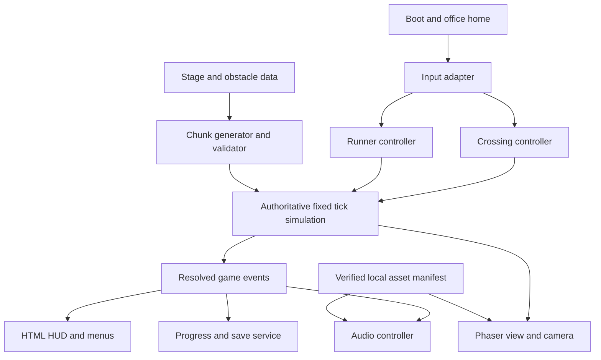

# Bas Ek Chai Product Requirements Document

**Version 1.0 · 7 September 2026**  
**Audience:** the product owner and the Codex agent implementing the game  
**Purpose:** build an original, polished, browser-based Indian pixel game from a new codebase, reusing verified free resources where they help.

## The product decision

Build **Bas Ek Chai**, an after-office journey through an Indian neighbourhood, with two playable modes:

- **Cross the Road:** deliberate tile-by-tile movement through a five-stage campaign, followed by an unlockable endless crossing mode.
- **Rush Hour:** an independently playable three-lane endless runner with lane changes, jumping and sliding.

Both modes start from the same animated office-exit home scene and share the protagonist, city, art style, audio and settings. They have separate movement, collision, scoring and difficulty rules. Rush Hour is available from the first launch; completing the campaign is not required to try it.

Use **Phaser 4.2.1, TypeScript and Vite** as the researched starting point. Use Kenney's matching city and indoor pixel tiles for the environment, then create the missing Indian characters, vehicles, shop details and animation. A collection of rectangles, a generic traffic demo, or imported packs with conflicting perspectives does not satisfy the visual requirement.

The optional **chai-and-sutta ending** is a cosmetic alternative to the chai ending. It gives no points, abilities, unlocks or gameplay advantage. This reflects the owner's explicit clarification.

This document replaces conflicting assumptions in the earlier Excalidraw blueprint. In particular, the commute happens after office hours, both movement modes are in scope, the old wireframe graphics are not an art target, and the engine baseline has been updated. Gameplay numbers below are initial design specifications to implement and test, not findings from player research or measured performance promises.

## Contents

1. [How the comments change the game](#1-how-the-comments-change-the-game)
2. [Research findings and choices](#2-research-findings-and-choices)
3. [The world and opening sequence](#3-the-world-and-opening-sequence)
4. [Release scope](#4-release-scope)
5. [Screens and controls](#5-screens-and-controls)
6. [Cross the Road rules and stages](#6-cross-the-road-rules-and-stages)
7. [Rush Hour rules](#7-rush-hour-rules)
8. [The obstacle system](#8-the-obstacle-system)
9. [Art direction and asset production](#9-art-direction-and-asset-production)
10. [Music and sound](#10-music-and-sound)
11. [Architecture and data](#11-architecture-and-data)
12. [Fair generation and collision](#12-fair-generation-and-collision)
13. [Quality and accessibility](#13-quality-and-accessibility)
14. [Build sequence](#14-build-sequence)
15. [Acceptance contract](#15-acceptance-contract)
16. [Codex handoff and remaining validation](#16-codex-handoff-and-remaining-validation)

## 1 How the comments change the game

Six annotations were read from the current editable Excalidraw canvas. Their dispositions are mandatory inputs to the build.

| Owner feedback | Product response | Where it is specified |
|---|---|---|
| Give the home screen a setting, such as a guy leaving office at the end of the day | Animated office lobby and street diorama; a short, skippable clock-out sequence; menu actions emerge from this setting | Sections 3 and 5 |
| Include scooters, bikes, autos, cars, pedestrians, cows and more | Distinct traffic and street-life roster, with different footprints, motion and player responses | Sections 6 and 8 |
| Explore a Subway Surfers-style mode too | Rush Hour gets its own tutorial, three lanes, jump/slide rules, procedural patterns, score and test coverage | Section 7 |
| Consider sutta | Optional chai-and-sutta finale, no gameplay bonus; the owner confirmed this choice during research | Sections 3 and 15 |
| Expand the stage thinking | Five recognisable stretches of a single evening commute; introduce, practise and combine mechanics | Section 6 |
| Improve the graphics substantially using existing libraries | Verified asset shortlist, a coherent pixel-grid contract, original Indian additions and an early scene-quality gate | Sections 9 and 14 |

## 2 Research findings and choices

### Two reference games suggest two different control models

Hipster Whale describes Crossy Road as an endless hopper through roads, railways and rivers. SYBO's own control guide assigns left/right swipes to lateral movement, up to jumping and down to rolling. These support the distinction between deliberate crossing and continuous running; they do not establish the balance or presentation of this new game. Bas Ek Chai will use original characters, maps, interface, audio and story. [Crossy Road official overview](https://www.crossyroad.com/) · [SYBO control guide](https://sybo.helpshift.com/hc/en/10-subway-surfers-1754912401/faq/285-basics/)

**Design choice:** retain a high-angle, oblique 2D pixel view in both modes. In crossing, the character hops through horizontal traffic. In the runner, the character faces away from the viewer and the road scrolls down through three fixed lanes. Jump height is shown with animation and a grounded shadow. This captures the requested runner actions without introducing a separate 3D production pipeline.

| Presentation option | What it adds | Cost or limitation | Decision |
|---|---|---|---|
| Shared oblique 2D view | Strong asset reuse and consistent pixel density | Less cinematic depth than a 3D runner | Ship this |
| Pixel sprites in a pseudo-3D receding road | More sense of depth | Scaling can shimmer; separate projection and collision presentation need testing | Later visual experiment |
| Full 3D or voxel world | Free camera and strong depth | New models, animation and rendering pipeline; weak reuse of the researched pixel tiles | Outside this release |

### Choose a game framework rather than assemble a renderer into one

| Option | Source-backed capability or constraint | Assessment for this game |
|---|---|---|
| Phaser 4 | Game scenes, input, audio, sprites and an official TypeScript/Vite scaffold | Recommended browser-first starting point |
| PixiJS 8 | A 2D rendering engine with scene graph, assets and pointer support | Viable, but requires more game lifecycle and gameplay infrastructure |
| Godot web export | Requires WebAssembly and WebGL 2; current Godot 4 C# projects cannot export to web; threaded export adds isolation requirements | Useful for an editor-led/native strategy, but unnecessary for this scope |

Sources: [Phaser TypeScript template](https://github.com/phaserjs/template-vite-ts), [PixiJS introduction](https://pixijs.com/8.x/guides/getting-started/intro), [Godot web export documentation](https://docs.godotengine.org/en/stable/tutorials/export/exporting_for_web.html). The recommendation is an engineering judgement, not a framework performance benchmark.

**Version trap:** the official release list shows Phaser **4.2.1, dated 9 July 2026**. The official template's package file still pins 4.0.0 and retains some Phaser 3 metadata. Some API pages identify themselves as 4.1.0. Start with 4.2.1, verify the installed types and behaviour, and commit a lockfile. Recheck the supported Node, Vite and TypeScript combination at implementation kickoff; do not inherit stale template versions blindly. [Phaser release list](https://phaser.io/download/phaser4) · [Template package file](https://github.com/phaserjs/template-vite-ts/blob/main/package.json) · [Vite prerequisites](https://vite.dev/guide/)

### Free resources are a foundation, not the finished art direction

The recommended Kenney environment packs have matching visual language and CC0 licences. Their archives were downloaded for inspection, and embedded licences and tile-grid information were checked. However, no reviewed free pack supplies the entire animated Indian commute roster. The original character, autos, cows, chai stall and local details remain real production work.

Two exclusions matter. LimeZu Modern Exteriors is paid, while the linked free version of Modern Interiors is explicitly restricted to non-commercial use. Neither is the default free, commercial-ready route. FreePD's current site states that it has closed, so old music download links should not become build dependencies. [Modern Exteriors](https://limezu.itch.io/modernexteriors) · [Modern Interiors free-version licence](https://limezu.itch.io/moderninteriors/devlog/244045/free-version-overview-18042021-update) · [FreePD current status](https://freepd.com/)

Research covered official gameplay references, engine and browser documentation, asset creator pages, licence texts, and selected art archives and previews. Audio licences were checked, but the audio shortlist was not auditioned. Further broad searching is unlikely to change the implementation direction; the remaining questions need dressed scenes, listening tests and playable builds.

## 3 The world and opening sequence

### Premise

It is 6:30 PM. The protagonist closes his laptop, picks up his bag and steps outside. The chai stall is only a few streets away. Between him and that break are office traffic, a busy market, monsoon puddles, a railway approach and a crowded chowk.

Use a fictional Indian neighbourhood, with a Mumbai/Pune-inspired visual brief rather than a claimed reconstruction of a real street. Keep ordinary life visible: office workers, food carts, shutters, painted shop signs, apartment balconies, scooters, buses, umbrellas, trees and small moments of humour. The setting should feel lived in, not consist solely of noise, congestion and hazards.

The default character is an adult male office worker with a rolled-sleeve shirt, ID lanyard, dark trousers and a shoulder bag. His bright shirt and consistent silhouette identify him instantly. Three clothing colour variants may share the same animations; none changes abilities.

### The first twenty seconds

1. The title loads over a real pixel scene: a lobby visible through glass, the office door, a pavement and moving traffic beyond it. A clock reads 6:30. The background is initially silent.
2. The protagonist shuts the laptop, stretches and collects his bag. This short sequence lasts about 4–6 seconds and is immediately skippable. Returning players see the settled lobby scene without replaying the sequence automatically.
3. Two clearly named actions appear: **Cross the Road** and **Rush Hour**. A one-line subtitle explains each. Continue Campaign appears when a checkpoint exists.
4. Selecting a mode opens the door and follows the character onto the safe pavement. This interaction also attempts to unlock audio. The transition lasts at most one second after assets are ready.
5. A first-time contextual tutorial teaches that mode. The player can skip, replay or take as long as needed; failure in the tutorial resets the exercise without recording a death or score.

Optional fictional microcopy includes “Bas ek chai”, “Kal kar lenge” and a silent notification reading “Quick call?”. Keep text brief, readable and separate from critical instructions. No real employer, product logo or recorded film dialogue is required.

### Arrival and the optional ending

After the campaign's final crossing, the camera settles at a warm-lit chai stall. The protagonist lowers his bag, accepts a cup and relaxes; steam, kettle movement and a short musical resolution make the destination feel earned.

The default is **Chai break**. Settings can enable **Chai and sutta ending**; the player can also choose that variant at the finale. The alternate adds a brief, skippable cigarette-break animation. Both endings bank exactly the same result and unlock the same content. No cigarette collectible, shop purchase, boost, health change, extra score or exclusive achievement exists. The preference persists and can be changed at any time outside active play. Use no real cigarette branding.

Rush Hour results return to the same rest-stop visual theme, but are not presented as campaign completion.

## 4 Release scope

### Required for version one

- Animated office home, accessible settings and credits.
- One fully animated protagonist, with inexpensive clothing variants.
- Cross the Road tutorial, five complete stages, checkpoint continuation, cause-specific failure, quick retry and both finale variants.
- Endless Crossing unlocked by the campaign finale.
- Rush Hour tutorial and a complete three-lane endless game, available immediately.
- The mandatory street roster in Section 8, introduced gradually rather than simultaneously.
- Cohesive selected pixel assets, original Indian additions, music, movement/UI sounds, traffic/rain ambience and visual equivalents for warnings.
- Deterministic authored/chunk-based generation, fair collision rules, local saves, mobile and keyboard input, pause/background handling and quality settings.
- Automated gameplay/flow checks plus real-device and listening evidence. Missing evidence must be reported rather than marked passed.

### Deliberately later

Online leaderboards, accounts, multiplayer, cloud saves, advertisements, purchases, paid revives, a spending economy, full 3D, daily challenge services, voice acting, additional cities and app-store packaging. A service worker and installable offline mode can follow the initial release; do not advertise offline reload before it is implemented and tested.

The first vertical slice is a milestone, not a reduction of the final scope. A build containing one street and a “coming soon” runner does not fulfil this PRD.

## 5 Screens and controls

### Screen contract

| Screen | Required content | Primary action and exit |
|---|---|---|
| Loading | Actual progress where available; short status; readable asset-error state | Retry failed essentials; no indefinite spinner |
| Office home | Animated setting, title, two mode choices, Continue if saved, settings, credits | Enter either mode directly |
| Mode tutorial | One action at a time, animated demonstration, safe practice | Continue automatically after success; Skip and Replay available |
| Crossing play | Stage name, row progress, provisional score, chai tokens, pause | Reach the stage goal or retry after failure |
| Runner play | Distance, provisional score, chai count, pause; first-use control hints | Continue running until failure or abandon through pause |
| Pause | Resume, Restart, Home, sound/motion controls | Explicit resume with frozen-world countdown |
| Stage clear | Banked stage result, next location, continue action | Next Stage or Save and Home |
| Failure | Exact cause, one useful tip, score/result, Retry, Home | Restart the same mode quickly |
| Finale | Chai scene, result, optional ending choice, Endless unlocked | Endless Crossing, Rush Hour or Home |
| Settings and credits | Volume buses, mute, motion, contrast, controls, assistance, ending preference; creator credits | Return to prior safe screen |

Use a 288×384 logical gameplay canvas as the first layout target. Keep the HUD and touch buttons in responsive HTML bands outside the hazard field. Fit the complete composition within the available viewport; preserve the same actionable view on different screens. Desktop gets decorative margins rather than an advantage from seeing farther ahead.

Buttons have text labels, visible focus, and at least 44×44 CSS-pixel hit areas. Menus work with keyboard and touch. A UI click must never also move the character. Instruction text uses a readable UI font; pixel typography is optional for short titles, not required for paragraphs.

### Controls

| Action | Cross the Road | Rush Hour |
|---|---|---|
| Swipe/tap left or A/Left | One tile left | Change one lane left |
| Swipe/tap right or D/Right | One tile right | Change one lane right |
| Swipe up or W/Up | One tile forward | Jump |
| Swipe down or S/Down | One tile backward | Slide while grounded |
| On-screen controls | Four-direction D-pad | Left, right, jump and slide buttons |
| Esc or P; pause button | Pause | Pause |
| Enter on focused menu action | Activate | Activate |

For touch, “tap left/right” means the explicit on-screen button, not an invisible region of the playfield. Do not make any arbitrary canvas tap move forward: that can conflict with swipes and menu input.

Start with a swipe threshold of 24 CSS pixels and a maximum gesture duration of 500 ms. Choose the dominant axis; a diagonal gesture produces one command. Track a pointer through release/cancel, including release outside the canvas. Expose sensitivity settings. Reject key-repeat events in the default discrete controls; one press produces one move. Releasing and pressing again is always sufficient.

Allow one buffered next command for at most 100 ms, then expire it. Clear the buffer on pause, failure, navigation and mode change. The command is revalidated when executed. There is no double-jump, swipe-chain teleport or unlimited queued movement.

## 6 Cross the Road rules and stages

### Movement and the basic loop

The player occupies a logical grid of nine columns. A gameplay cell is 32×32 world pixels, assembled from the 16-pixel art tiles. One directional command requests one adjacent cell. Start with a 12-tick hop at a 60 Hz simulation rate, or 200 ms. The visual hop does not make the player invulnerable and does not leap over cars or water.

The loop is **observe traffic → choose a gap → hop → land → reassess**. Traffic continues while the player waits. There is no timer, forced scrolling or punishment for waiting. Backward movement is allowed within the current stage. A blocked destination gives a brief bump cue without consuming a life or pushing the player into danger.

The camera follows the player without exposing hidden dangers through sudden jumps. The finite campaign retains the whole current stage, so backtracking does not destroy its traffic state. Endless Crossing retains a bounded history; the oldest retained safe row becomes a visibly blocked retreat boundary, never an invisible kill line.

### Campaign structure

There are 24 scoreable forward rows per stage, with a non-scoreable start row 0. Rows 6, 12, 18 and 24 are safe full-width stops; row 24 is the goal. Additional safe rows are permitted. No stage contains more than five consecutive moving lanes, and early stages use fewer. Reaching the goal clears the stage only after collision resolution.

All five stages occur during the same evening; the earlier board's morning-to-midday sequence is superseded. Weather changes are a fictional scripted commute, not a real-time weather feed.

| Stage | Setting and visual identity | Teach and combine | Initial challenge limits |
|---|---|---|---|
| 1 Office Gully | Warm sunset, glass office, security cabin, parked two-wheelers | Waiting, forward/backward hops, simple scooter and car lanes | 1–2 moving lanes per block; visible gaps; early protected practice |
| 2 Bazaar Road | Awnings, vegetable carts, shutters, pedestrians and chai signage | Autos of different widths; detours around parked objects; sidewalk reservations | Up to 3 moving lanes; no unexplained swerves; introduce a stationary cow safely |
| 3 Monsoon Junction | Rain, umbrellas, lit windows and subtle puddle reflections | Long buses; shallow puddles versus blocked/deep hazards; route choice | Up to 4 lanes; rain never obscures warning shapes or vehicle edges |
| 4 Railway Approach | Barrier arms, signal lights, station wall and feeder street | Stop for advance warning; cross only through an authored safe window | One rail corridor per block; safe refuge before and after; feeder traffic introduced separately |
| 5 Chai Chowk | Night market, warmer destination light, brighter street furniture | Combine previously taught vehicles, signals and detours | Up to 5 lanes; bounded speed/gaps; no new hazard family introduced at the finale |

Within each stage, the first block isolates the new mechanic, the second practises it, and the last two combine it with known hazards. Each stage must contain at least two alternative safe route opportunities rather than one pixel-perfect solution.

Vehicle tuning begins with 1.0–2.0 cells/second in Stage 1, 1.5–2.5 in Stage 2, 1.5–3.0 in Stage 3, and at most 3.5 for ordinary traffic in Stages 4–5. Trains have separately authored timing and may move faster after the corridor warning. These speeds must be reconciled with visible approach distance and the validated gap windows before shipping.

### Scores and checkpoints

- Award +1 when the player first reaches each new forward row in the current stage, and +5 for each optional chai token. Sideways movement, backward movement and repeated visits give no distance points.
- Tokens have stable IDs and can be collected once per attempt. Place a maximum of three per stage in tempting but reachable locations; they must never be necessary for progress.
- While playing, the stage score is provisional. On clear, bank it once against that stage in the current campaign, advance `nextStageId`, and save one consistent snapshot.
- On a hit or fall, discard the current stage's provisional points and tokens. Preserve previously banked stages. Retry the same stage layout and seed, from row 0, so the player can learn the pattern.
- Continuing after reload starts the next uncompleted stage from its beginning. Mid-stage position is not saved. Do not display “resume exactly where you left off”.
- A new campaign resets the active campaign total but preserves best campaign score, tutorials, cosmetics and unlocked modes. Finishing computes a best score; replaying does not accumulate spendable currency.
- Unlock a shirt variant after Stage 3 and another after Stage 5. They are cosmetic. Unlock Endless Crossing after the finale.

Endless Crossing uses the same hop controls and +1/+5 scoring, but has one life, fresh run generation and no campaign checkpoints. Cap difficulty rather than increasing speed forever. Maintain a separate best score for this mode.

## 7 Rush Hour rules

### Purpose and presentation

Rush Hour is for the player who wants continuous reaction rather than waiting for a crossing gap. The protagonist automatically runs up the street while the world scrolls down. Three clearly readable travel lanes run through the neighbourhood. Shops, parked vehicles and pedestrians on the edges provide context; only objects inside the gameplay corridor can affect the run.

Use the same oblique pixel art, lighting and character identity as the crossing mode. Do not add a copied inspector, police chase, hoverboard or reference-game branding. The character is hurrying toward his break; the endless route is an arcade extension of that premise.

### Action model

Lane centres initially sit at world x = 80, 144 and 208 on the 288-pixel canvas. Lane indices are 0, 1 and 2. Changing lanes takes 10 ticks, about 167 ms, and collision follows the travelled path. One command moves one lane; the centre-to-edge transition cannot skip an occupied space.

Jump lasts 42 ticks, or 700 ms. A defined clearance interval within the animation determines when low obstacles can be cleared. Start with ticks 12–30 as that interval, then tune the visual arc to match it. Slide lasts 36 ticks, or 600 ms, with an immediate lowered pose and matching collision height. There is a 6-tick recovery after each jump or slide before the next vertical action.

Lane changes are allowed while jumping or sliding. Jump and slide cannot overlap. A slide request while airborne is ignored; fast-drop and double-jump are outside this release. These restrictions must be shown in the tutorial and represented in the generator's reachability model.

Cars, buses, autos, cows and full-height barricades are avoidance obstacles: neither jumping nor sliding bypasses them. Low crates and shallow construction rails are jumpable. A clearly marked overhead banner frame is slideable. The artwork must make each response class distinct before the player reaches it.

### Difficulty and pattern generation

Start at 6 metres/second. Increase by 0.5 metres/second every 250 metres, capped at 10. Use a proposed presentation scale of 16 world pixels/metre, making the maximum world scroll 160 pixels/second. Keep at least 1.5 seconds of clear, actionable warning before any newly presented mandatory response at the current relative approach speed. This implies at least 240 pixels of visible warning distance for a stationary obstacle at maximum scroll speed; oncoming vehicles require more.

Place the character near the bottom of the playfield and reserve the required lookahead above him. If a layout cannot provide the warning distance, lower speed or simplify the pattern; do not crop the preview to accommodate the HUD.

The first tutorial separately teaches lane changes, jumping, sliding and a two-action combination. The first 150 metres of a normal run use forgiving avoidance patterns; introduce low and overhead obstacles after that without stacking unfamiliar demands. Scenery changes in 250-metre bands through office, market, rain and station-edge themes. These are scenery/difficulty bands, not campaign checkpoints.

Create at least 12 authored starter patterns: four avoidance, three jump, three slide and two recovery patterns. A pattern records obstacle positions, time gaps, legal entry/exit states and difficulty range. Remix only validated patterns, checking their joins. Later complexity should come from timing and combinations, not unlimited speed or surprise lane changes.

Never generate three simultaneous full-height lane blockers. More subtly, do not accept a nominally empty lane if the player cannot reach it before impact. After a demanding sequence, include at least one second without a mandatory action. Never require a perfect timing window narrower than the configured reaction margin.

### Failure and score

One collision ends the run, with a comic stumble and clear cause. Contact with a pedestrian or cow means the player stumbles; the scene does not depict harming that character. There is no paid revive or second-life mechanic.

Score is `floor(distanceMetres) + 5 × collectedChai`. Distance is simulated forward progress, not wall-clock time, and is frozen while paused. Jumping in place and lateral movement do not add distance. No multiplier or near-miss bonus is included in version one. Save Rush Hour's best score separately from both crossing variants. Retry starts a new seed; deterministic seed entry is a development tool, not a required player menu.

## 8 The obstacle system

Each entity needs a stable ID, visual class, collision footprint, mode-specific behaviour, cue and failure/blocking result. “Everything” means a convincing range of street life with readable rules, not random objects doing anything.

| Entity | Cross the Road behaviour | Rush Hour behaviour | Readable cue |
|---|---|---|---|
| Scooter | Narrow moving traffic, predictable speed | Lane-bound avoidance vehicle | Rider posture, facing, approach visibility |
| Motorbike | Distinct silhouette; slightly faster authored lane | Faster avoidance encounter in later bands | Headlight/facing plus sufficient approach distance |
| Auto-rickshaw | Medium footprint, steady route | Full-height lane blocker or controlled oncoming vehicle | Distinct roof/body silhouette; brief visible turn indicator only if a scripted turn exists |
| Car or taxi | Standard moving lane hazard | Avoidance; parked or moving by pattern | Vehicle orientation, road marking and approach |
| City bus or truck | Long footprint that occupies the gap longer | Unjumpable large blocker | Long silhouette; no hidden trailing hitbox |
| Bicycle | Slower, narrow authored traffic | Optional later avoidance variation | Pedalling cycle and facing |
| Pedestrian | Walks on reserved sidewalk paths; blocks without causing death | Avoidance in authored corridor patterns; collision ends player's run with a stumble | Facing and walk cycle; no spawn under player |
| Cow | Static or slowly moving sidewalk/edge blocker | Clearly visible avoidance obstacle | Full body silhouette and idle movement; no sudden charge |
| Handcart | Static or slow blocker, placed with alternate route | Full-height blocker | Wheels, load and consistent footprint |
| Parked vehicle | Blocks its cells | Full-height blocker | No motion streak/engine cue; readable parking position |
| Shallow puddle | Safe, cosmetic splash | Safe, cosmetic splash | Blue surface without danger stripes; no hidden slowdown |
| Open drain or deep water | Marked fall hazard, ends attempt | Avoidance hazard; never implicitly jumpable | Broken-edge shape and striped rim, not colour alone |
| Low crate or low rail | Ordinary blocked tile; hop is not a clearance jump | Jumpable obstacle | Short silhouette and taught jump cue |
| Overhead frame | Scenery outside crossing route | Slideable obstacle | Visible space underneath, striped top beam and taught slide cue |
| Train | Timed rail corridor with warning and safe refuges | Background set dressing in version one | Crossing lights, barrier animation and bell; audio never acts as the sole warning |
| Traffic signal | Authored phases stop/release traffic | Background or authored movement cue | Shape/icon plus countdown; vehicle behaviour agrees with phase |

Start ordinary incoming-hazard cues at least 1.5 seconds before potential conflict, and train warning at least 2 seconds. The train corridor must additionally allow enough time for a player already committed to exit; the minimum warning duration alone is not a safety proof. Moving actors never materialise on the player. Decorative lights, horns and exhaust must not look like controls or pickups.

Traffic stays in its assigned lane in version one. Any later lane-change behaviour requires a separate cue, reservation model and test suite. Avoid random swerving as a shortcut to an “Indian” feel.

## 9 Art direction and asset production

### The desired image

The game should look like a small, carefully composed pixel city at the end of a workday. Use layered storefronts, readable road surfaces, pavement texture, doorways, signs, foliage and selective animated details. Warm window light and the chai stall contrast with cool asphalt and the monsoon sky. The protagonist and collision-relevant edges remain legible in all weather.

The original Excalidraw screens communicate layout only. They must not be exported as background art or reproduced as flat boxes. The scene-quality target is actual sprites and tiles, coherent perspective, good animation and composition at ordinary phone size.

### Verified resource shortlist

All availability/licence findings below were checked on 7 September 2026. “Candidate” means source/licence evidence exists but final integration or animation quality has not been verified.

| Resource | Licence and acquisition | Use and limitation |
|---|---|---|
| [Kenney Roguelike Modern City](https://kenney.nl/assets/roguelike-modern-city) | Free CC0; [official ZIP](https://kenney.nl/media/pages/assets/roguelike-modern-city/0ff3dfff2b-1677694743/kenney_roguelike-modern-city.zip) inspected | Primary city base: offices, shops, roads, street furniture and matching vehicles. 16×16 tiles, 1-pixel spacing, 37×28 grid. Archive v2.0 is dated 2022-10-29; website lists original 2015 release. |
| [Kenney Roguelike Indoors](https://kenney.nl/assets/roguelike-indoors) | Free CC0; [official ZIP](https://kenney.nl/media/pages/assets/roguelike-indoors/4d5b520b03-1702169567/kenney_roguelike-indoors.zip) inspected | Matching indoor starting material. 16×16 tiles with 1-pixel spacing. Select furniture carefully; office laptop, ID gate and bag may need original work. |
| [Kenney Roguelike Characters](https://kenney.nl/assets/roguelike-characters) | Free CC0; archive inspected | Distant NPC/reference material only. Tiny modular characters do not supply the verified full animation set required for the hero. |
| [Pixel Art Cars and Trucks by Newc42](https://newc-42.itch.io/pixel-art-cars-trucks) | Free/name-your-price CC0; PNG and Aseprite archives listed, published 2025-12-28 | Reserve vehicle source. Preview includes oblique/top and side views; stronger outlines require palette, scale and outline adjustment. Do not import all views together. |

The inspected [Kenney Pixel Vehicle Pack](https://kenney.nl/assets/pixel-vehicle-pack) is CC0 but side-view, so it is not part of the default oblique scene. Licence compatibility does not solve perspective mismatch. Detailed paid packs such as LimeZu remain optional alternatives only; this build has no paid-asset dependency.

CC0 permits copying, modification and distribution, including commercial use. Keep creator/source records anyway; do not use a creator's logo or imply endorsement. Kenney expressly states that attribution is optional. [CC0 terms](https://creativecommons.org/publicdomain/zero/1.0/) · [Kenney licence FAQ](https://kenney.nl/support)

### Pixel and animation contract

| Item | Initial specification |
|---|---|
| Environment grid | Native 16×16 source tiles; two tiles per 32-pixel logical hop cell |
| Perspective | One high-angle/oblique 2D view; consistent baselines and light direction |
| Hero | Start on a 24×32 pixel canvas with a smaller visible body and consistent transparent padding; validate scale against doors and vehicles before finalising |
| Player footprint | Separately authored ground rectangle around the feet; start near 12×10 pixels and tune visibly |
| Palette | Muted warm/cool environment; brighter identifiable player; one consistent outline treatment |
| Texture sampling | Nearest neighbour; preserve source pixels; no blurred resizing or arbitrary sprite rotation |
| Layering | Ground, road marks, shadows, actors sorted by ground baseline, foreground canopy, effects, UI |
| Effects | Small dust/splash sprites, restrained contact shadows, occasional steam and rain; all bounded |

Required hero animation set: idle and directional walking; four-direction hopping; upward runner cycle; jump; slide; stumble; cup-taking/celebration; and the optional ending clip. As an initial production budget, use 2 idle frames per direction, 6 walk frames per direction, 4 hop poses per direction, 6 upward run frames, 6 jump frames, 4 slide frames, 4 stumble frames and 6 arrival frames. Reuse poses where visually sound rather than fabricating unnecessary animations. Clothing variants must share frame bounds and collision data.

Required original or adapted objects include an auto-rickshaw with legible facing, cow idle/walk poses, office worker, delivery scooter treatment, local bus/taxi treatment, chai cart with kettle and cups, shopfront signs, office entry details and monsoon variants. Make these as source-editable art. Treat them as unfinished until they exist and pass the scene-quality checks.

### Production workflow

1. Select one environment family and inspect its archive. Record exact files, licence and hash before integration. Do not assume every file in a marketplace search result has the same terms.
2. Compose one office-and-crossing scene with real selected tiles. Test hero scale and readable road width. Make a second runner scene with the same camera/art treatment.
3. Produce the missing Indian identity layer in the same pixel grid. Avoid enlarging a tiny static character and calling it a fully animated hero.
4. Keep editable sources and deterministic export steps. [Pixelorama](https://github.com/orama-interactive/pixelorama) is an MIT-licensed pixel editor with animation, spritesheet export and command-line export facilities; [Piskel](https://www.piskelapp.com/?lang=en_gb) is a free browser alternative with sprite-sheet exports.
5. Use authored JSON content or [Tiled's JSON export](https://docs.mapeditor.org/en/latest/manual/export-generic/) for maps. Separate decorative layers from collision and spawn metadata; never infer gameplay solely from a painted colour.
6. Slice with the verified grid spacing. Pack selected frames into bounded runtime atlases with appropriate edge padding. Preserve pivots, frame dimensions and animation definitions in data.
7. Check each scene at native scale and actual phone scale. Inspect every mandatory hazard class, occlusion, weather contrast and jump/slide pose.

**Visual completion gate:** both scenes contain finished hero/auto/cow sprites, dressed streets and appropriate UI; there are no placeholder rectangles for major actors, mixed perspectives, blurry pixels, hidden collision edges or unreadable overlays. Capture a short animated clip as well as a still. A pretty screenshot alone does not verify motion.

## 10 Music and sound

### Direction

Use a light, rhythmic electronic score with quiet environmental texture. A small recurring melody should connect the office, journey and relieved chai arrival. Indian character should emerge from the scene and original rhythmic choices, rather than an arbitrary stock “Indian” track placed over unrelated visuals.

Begin by auditioning the following licence-cleared candidates. The research did not listen to the files, establish their loop seams, or certify their regional authenticity. Selecting an actual file and testing it is part of the build.

| Resource | Licence and source date | Intended audition |
|---|---|---|
| [Interface Sounds by Kenney](https://kenney.nl/assets/interface-sounds) | Free CC0; v1.0, 2020; 100 files | Menu click, confirm, return and pause |
| [Digital Audio by Kenney](https://kenney.nl/assets/digital-audio) | Free CC0; v1.0, 2012; 60 files | Short hop/pickup tones; the pack is space/laser themed, so reject unsuitable sounds |
| [Impact Sounds by Kenney](https://kenney.nl/assets/impact-sounds) | Free CC0; v1.0, 2019; 130 files | Soft landing, bump, restrained failure and cup placement |
| [Chiptune Exploration by Ansimuz](https://opengameart.org/content/chiptune-exploration) | CC0; 28 October 2021; public ZIP; creator permits commercial use | First gameplay music candidate; confirm mood and looping |
| [Rain loopable by Ylmir](https://opengameart.org/content/rain-loopable) | CC0; 28 March 2016; four 25–45-second loops, OGG/MP3 | Light/heavy monsoon ambience |
| [High traffic road sounds by IgnasD](https://opengameart.org/content/high-traffic-road-sounds) | CC0; 14 December 2015; public OGG | Low-level generic traffic bed; no claim that it was recorded in India |
| [car horn wav by keweldog](https://freesound.org/people/keweldog/sounds/182474/) | CC0; 30 March 2013; 4.322-second WAV; login required for full download | Trimmed vehicle cue; optional because acquisition needs an account |
| [train passing cars wav by cognito perceptu](https://freesound.org/people/cognito%20perceptu/sounds/17366/) | CC0; 27 March 2006; 38.403-second WAV; login required | Whistle/pass-by candidate, distinct from the game's timed warning bell |

Do not make a login-gated sample a blocker. Use an original synthesised horn or railway cue if the file is unavailable. If the music candidate does not fit, create an original short chiptune loop using an original melody and synthesised percussion, preserve the composition source, and retain the same listening acceptance gate. No ripped film music, commercial jingles or unlicensed samples.

### Cue and mix contract

| Event | Initial duration or behaviour |
|---|---|
| Hop or lane movement | Brief 50–100 ms accent; subtle variants to avoid fatigue |
| Chai pickup | Distinct 120–200 ms tone, once per token |
| Landing/bump | Soft foley, quieter than warnings |
| New hazard warning | Tied to the simulation event and a visible symbol/facing cue; not to a guessed audio playback position |
| Failure | Restrained thud and descending motif under 500 ms; no excessive alarm |
| Stage clear | 1–2-second resolution, after the world freezes |
| Finale | Quieter arrangement, kettle/cup foley, relieved musical ending |
| Rain/traffic | Low-volume loop; no speech or music fragments that imply unrelated rights |

Provide master mute plus separate music, effects and ambience volumes. Persist settings. Reserve audio priority for actual warnings; allow no more than two simultaneous decorative horns. Duck ambience/music during important cues and prevent old loops from surviving retries or mode switches.

Start audio only through an intentional interaction and handle blocked playback gracefully. Phaser's sound manager is global across scenes, so scene transitions must explicitly release or crossfade owned sounds. Silent play remains complete. [MDN autoplay guidance](https://developer.mozilla.org/en-US/docs/Web/Media/Guides/Autoplay) · [Phaser audio lifecycle](https://docs.phaser.io/phaser/concepts/audio)

Keep lossless masters where available and export only the selected browser-ready files, with a tested format fallback where needed. Listen on headphones and phone speakers; test ten loop boundaries, rapid retries, low volume, master mute and simultaneous warning/music playback. Reject clipping, audible seams, startling level jumps, masking and excessive repetition.

## 11 Architecture and data

### Responsibilities

Use Phaser for loading, rendering, scene lifecycle, input collection and audio playback. Keep gameplay state and decisions in small testable TypeScript modules. The first implementation does not need a general ECS framework, a game server or a React application around every sprite.



Suggested repository structure is an implementation starting point, not a demand for empty abstraction layers:

```text
src/
  app/             boot, routing and HTML menus
  game/scenes/     Office, Cross, Rush and shared presentation
  game/core/       clock, events, seeded RNG and run state
  game/crossing/   grid, traffic, stage state and scoring
  game/runner/     lanes, action state, distance and scoring
  game/world/      chunks, schedules and reachability
  game/collision/  hitboxes and swept intersection rules
  services/        input, audio, assets and saves
  content/         stages, hazards, patterns and text
public/assets/     only selected runtime images and audio
assets-source/     editable original art and source masters
licenses/          third-party notices and licence evidence
tests/             simulation, flow, content and visual checks
```

A shared scene must never accidentally interpret the same command under both mode rules. Use a `ModeController` interface or separate gameplay scenes with explicit ownership. Switching mode destroys prior actors, timers, event subscriptions and active commands before creating the next run.

### State transitions

`BOOT → HOME → TUTORIAL or PLAYING`. Playing transitions to Paused, Failed, or Stage Clear. Paused returns to Playing only through Resume and a countdown. Failed goes to Retry or Home. Stage Clear goes to the next stage or Finale. The runner transitions to Failed, never to a campaign Stage Clear. Finale enables Endless Crossing without changing Rush Hour access.

On blur, visibility loss or a serious interruption, stop the simulation, controls and relevant audio. Resume requires deliberate action. The 3–2–1 countdown does not advance traffic, jump time, score, train warnings or runner distance. Flush stale pointer/key state before resuming.

### Minimum data contracts

| Record | Required fields |
|---|---|
| `StageDefinition` | ID, content version, row count, safe rows, chunk IDs, allowed hazards, speed/gap limits, palette, ambience and destination |
| `HazardDefinition` | ID, asset/animation key, mode behaviour, ground hitbox, height class, response class, cue, warning minimum and scoring policy |
| `ChunkDefinition` | ID/version, mode, geometry, entity schedules, legal entry/exit states, difficulty range and safe fallback reference |
| `RunState` | Mode, seed, content version, tick, player state, actors, collected IDs, provisional score, difficulty and terminal event |
| `AssetRecord` | ID, creator, source URL, download URL, licence ID/link, acquisition date, source/runtime path, SHA-256, edits and credit text |
| `SaveData` | Schema version, settings, per-mode tutorials, campaign checkpoint/banked stage results, mode unlocks, cosmetics and three separate best-score records |

No asset record may claim a checksum, frame count, download or licence verification that has not actually occurred. Validate content at build time so missing sprite keys and unsupported hazard combinations fail visibly before release.

### Saves and error handling

Use one versioned localStorage JSON snapshot for durable progress. Validate types, ranges, known IDs and schema before accepting it. Handle storage denial and malformed JSON by retaining safe in-memory defaults and showing a brief “Progress cannot be saved in this browser” message. A save failure must not stop play. Write on settings changes, checkpoint completion and results; never every frame.

Store checkpoints and their banked points together, avoiding a crash window where the stage advances but its score does not. Completing a stage twice through duplicate events must not bank twice. Preserve best scores on a new campaign and preserve separate values for standard and assisted play.

Local storage is origin-specific and can be unavailable or cleared. The product promises local progress only, not cross-device persistence. Serve through HTTP(S); do not rely on opening `index.html` as a file for save behaviour. [MDN localStorage](https://developer.mozilla.org/en-US/docs/Web/API/Window/localStorage)

An essential image-load failure gets a readable Retry/Home state rather than invisible hazards or substitute rectangles in a release build. A failed optional audio asset allows silent play. Context loss or a broken renderer must freeze the simulation and offer recovery without continuing unseen.

### Asset ingestion and redistribution

Use the source page as the canonical lookup and a verified download link as the acquisition route. At build kickoff, recheck both and preserve the embedded licence. CC0 assets can be committed with their provenance; custom-licensed alternatives require their own redistribution check. Runtime assets must be local and versioned, never hotlinked to a marketplace or audio preview CDN.

Keep the asset inventory separate from game-code licensing. Credit creators in the game and a readable credits file even where optional. Include only selected runtime files in the production bundle. Do not publish whole unneeded archives merely because they are available.

## 12 Fair generation and collision

### One authoritative clock

Advance gameplay at 60 fixed ticks per second, with timestamped input commands. Rendering can interpolate positions but cannot change the simulation. Use separate seeded streams for gameplay and cosmetics so adding rain particles does not rearrange traffic.

Choose exactly one owner of movement/collision. The recommended version-one approach is the pure TypeScript simulation with Phaser as its view; do not also let an independently running physics world move the same actors. Phaser has fixed-step facilities if that alternative is chosen, but a fixed timestep alone does not prove that fast obstacles cannot tunnel. [Phaser Arcade World documentation](https://docs.phaser.io/api-documentation/class/physics-arcade-world)

Clamp catch-up work to five ticks per rendered frame. If a frame interruption is greater than 250 ms, pause before advancing dangerous gameplay and discard the stale catch-up interval. Do not silently accelerate through a long hidden interval or vary difficulty with display refresh rate.

### Collision rules

Check relative swept movement between the previous and next positions of the player and hazards. Use ground hitboxes rather than the whole transparent image bounds. Hopping over a vehicle in a crossing animation does not evade collision. Runner jump/slide clearance is determined by the action's explicit clearance state and the obstacle height class, including entry and exit boundaries.

Resolve events in stable order: validate command, move/schedule actors, find contacts, resolve terminal collision, then process non-terminal pickups and goals. If death and a pickup/goal occur in the same tick, death wins and no same-tick reward is banked. After a terminal event, ignore further movement and scoring. Every entity and pickup has an ID to suppress duplicate effects.

Pedestrian reservations in crossing prevent two bodies from claiming the same landing tile. They yield to a committed player landing where appropriate and never shove the player into traffic. An invalid destination command is rejected safely; the player is not teleported to a random free square.

### Solvability is a time-dependent property

Begin with authored chunks, not arbitrary per-row random spawning. For crossing, validate a sequence of wait/hop states through the actual traffic schedule, including safe waiting cells, hop duration and retreat. For the runner, validate lane/action states through the lookahead window, including lane transitions, jump/slide recovery and speed. Check chunk joins, not only chunks in isolation.

Use conservative occupancy and the same movement/collision model as the game. Include a reaction allowance, initially 350 ms in addition to any necessary action transition. Reject routes that require unseen hazards or timing narrower than this allowance. A route that is mathematically possible but gives no reasonable warning is not acceptable.

Limit candidate generation to eight attempts. On failure, emit a known-safe recovery chunk. For crossing it contains a clear safe median and a simple proven traffic gap; for the runner it contains a recovery stretch and at most one avoidable blocker. Generation must never hang or reduce warning time to force acceptance.

Record seed, mode, content/generator version and initial assistance settings for reproduction. Before release, run a fixed corpus of 10,000 seeds per endless mode and difficulty band through the validator, including joins and deliberate adversarial cases. This is a coverage target, not proof that every possible sequence is fun or solvable. Independently test known impossible patterns so a validator that always returns true cannot pass.

## 13 Quality and accessibility

### Initial performance budgets

These are targets to measure during the vertical slice. Any revision must be documented with device evidence.

| Measure | Target and measurement |
|---|---|
| Essential first-play transfer | At most 5 MiB compressed, excluding deferred music/stage content; record a clean network capture |
| Total selected runtime content | Aim for at most 15 MiB transferred; ship selected files rather than complete packs |
| Input feedback | Visible acknowledgement within 100 ms on the tested reference phones |
| Rendering | Target 60 FPS with p95 frame interval at most 20 ms during a 60-second worst-case scene; record p50/p95/p99 and stalls |
| Low effects | Reduced particles/reflections; a declared 30 FPS fallback targets p95 at most 35 ms while simulation remains 60 Hz |
| Restart | At most one second to playable state once essential assets are resident; no re-download of cached essentials |
| Stability | No sustained rise in active actors, audio loops or listeners after 50 retries and a 20-minute endless run |

Use nearest-neighbour texture sampling and pixel rounding; Phaser's `pixelArt` configuration supports this. Prefer integer display scales where they fit, but inspect fractional scaling rather than pretending every viewport can be perfectly integer-scaled. [Phaser pixel-art configuration](https://docs.phaser.io/api-documentation/constant/core)

Test Chromium, Firefox and WebKit flows, plus real Android Chrome and iPhone Safari smoke tests. Record device model, OS, browser version, viewport and seed. Playwright can emulate viewport and touch settings, but that is not evidence of real phone performance or audio behaviour. If real devices are unavailable, mark those tests pending. [Playwright emulation documentation](https://playwright.dev/docs/emulation)

### Accessibility requirements

- Every hazard warning has a visible equivalent. Use shapes, direction and icons alongside colour.
- All menu actions and gameplay actions have keyboard and touch alternatives. Remapping and visible control hints belong in settings.
- Preserve readable text, focus states, contrast and large touch targets. Never require a tiny pixel-font paragraph to understand the next action.
- Provide music/effects/ambience controls, master mute, low motion and reduced effects. Low motion disables camera shake and strong bobbing without altering collision timing.
- Offer an assisted speed option, initially 75 percent, applied consistently to gameplay clocks and warnings. Label assisted results and store their best scores separately. Cosmetic settings do not change score categories.
- Keep tutorials replayable, skippable and untimed. Do not rely on rapid tapping, motion controls, haptics or hearing.
- Save settings and expose them before starting a run. Focus loss pauses the game without penalty.

These choices follow the relevant principles in the [Game Accessibility Guidelines](https://gameaccessibilityguidelines.com/basic/); they are not a claim of comprehensive accessibility certification. Nonvisual play has not been specified for this visual reflex game, so do not label the entire game screen-reader playable. Menus should still use semantic accessible controls.

### Playtest questions

With at least five first-time players, check whether they can explain both modes, move without verbal coaching, distinguish blocking/jump/slide hazards, understand why they failed, and locate Retry and Pause. Record observations and revise the tutorial or artwork when failures repeat. Ask specifically whether the world feels like a coherent Indian evening scene and whether the character reads clearly on a phone. These are planned tests; no player results exist yet.

## 14 Build sequence

| Milestone | Concrete deliverable | Exit condition |
|---|---|---|
| M0 Foundation and resource lock | New repository, pinned toolchain, basic scene startup, asset/notice inventory, test harness | Clean install/build; chosen assets load; source and licence records are valid |
| M1 Visual and movement slice | Office home, one dressed crossing scene and one dressed runner scene, finished hero/auto/cow core art, both control models | Scene-quality checklist passes; touch/key input and jump/slide readability demonstrated in clips |
| M2 Complete short loops | Crossing tutorial and Stage 1 through clear/retry; runner tutorial and starter patterns; pause/audio/save | Each mode is playable from home through failure and restart; core acceptance tests pass |
| M3 Complete world | Campaign Stages 2–5, all mandatory hazards, checkpoint continuity, finale and optional ending, both endless variants | Full commute works; Rush Hour remains independently accessible; rules and content validate |
| M4 Polish and release candidate | Audio selection, transitions, effects, accessibility, performance and licence packaging | Acceptance contract complete or explicitly reported gaps; reproducible build and review evidence supplied |

M1 is deliberately early because graphics were the strongest criticism of the blueprint. Do not build five environments around art that has already failed the scene-quality check. During a quality correction, improve the actual asset selection, animation or composition rather than covering weak sprites with particles and filters.

Keep source, tests, content and asset notices in the repository throughout. Preserve an implementation log of decisions that change the PRD, with the reason and affected tests. Do not silently drop the runner, original art tasks or optional ending to meet an arbitrary time estimate.

## 15 Acceptance contract

Every case below has an observable result. Automated checks should target gameplay behaviour, not merely repeat the implementation formula. Manual visual/listening/device checks need evidence and may not be marked passed by a unit test.

### Home and common flows

| ID | Test | Required result |
|---|---|---|
| H01 | Open a clean profile | Office setting appears; both named modes are available; no sound starts before interaction |
| H02 | Skip opening; return after a played run | Skip responds immediately; return does not force the full opening again |
| H03 | Use only keyboard, then only touch | Home, settings, tutorials, pause, retry and both modes are reachable |
| H04 | Click Pause or a menu over the game | No unintended move is issued to the player |
| H05 | Change mode after repeatedly playing the other | No old actors, queued commands, music loops or scores leak into the next mode |
| H06 | Deny an essential image; deny optional audio | Essential image produces a recoverable error; optional audio failure still allows readable silent play |
| H07 | Resize, rotate or background during a gesture | Gesture is cancelled; no stuck movement; controls remain on-screen; dangerous play is paused |

### Crossing

| ID | Test | Required result |
|---|---|---|
| C01 | Send single, repeated and diagonal inputs | One valid command moves one tile; no diagonal teleport or default key-repeat burst |
| C02 | Wait at a safe stop for 30 seconds | Traffic advances, but no idle death or forced camera movement occurs |
| C03 | Attempt a blocked tile; retreat and revisit rows | Safe rejection; no push into traffic; no duplicate distance score |
| C04 | Cross a car's path during the middle of a hop at maximum speed | Swept contact detects the hit; visual height grants no immunity |
| C05 | Finish each of the five stages | Distinct setting/mechanic progression, safe rows and valid goal transition are present |
| C06 | Fail after collecting tokens in Stage 3 | Stage 3 provisional result resets; banked Stages 1–2 remain; retry uses the same stage seed |
| C07 | Trigger duplicate clear events, then reload | The stage banks once and the checkpoint/points remain consistent |
| C08 | Reach pickup and lethal contact in the same tick | Failure wins; no same-tick pickup or stage-clear reward |
| C09 | Finish campaign and start a new one | Endless Crossing unlock persists; active campaign resets; best score and cosmetics persist |
| C10 | Reach the retreat boundary in Endless Crossing | Visible safe blocking boundary; no deletion under the player or invisible death |

### Runner

| ID | Test | Required result |
|---|---|---|
| R01 | Launch Rush Hour before playing campaign | Mode and its tutorial work without a campaign unlock |
| R02 | Change lane beside an obstacle | Transition takes time and checks the travelled path; no skipping through a blocked lane |
| R03 | Jump a low rail and attempt to jump a bus | Correctly timed rail clearance succeeds; the bus remains a full-height collision |
| R04 | Slide an overhead frame; issue slide in midair | Grounded slide succeeds; airborne slide is ignored without corrupting state |
| R05 | Combine lane change with jump/slide | Legal combined actions work; conflicting vertical actions and expired buffered input do not |
| R06 | Reach all speed bands and run beyond the cap | Speed stops increasing at the configured maximum; visible warnings remain sufficient |
| R07 | Inject a pattern with a free but unreachable lane | Validator rejects it; bounded generation falls back safely |
| R08 | Pause for 30 seconds; resume | Distance, score, obstacles and action timers stay frozen until countdown completes |
| R09 | Hit a pedestrian or cow | Player stumbles and the run ends; no harm animation for the other actor |
| R10 | Retry and compare scores across all modes | Rush Hour restarts cleanly and has its own best score; no campaign banking occurs |

### Art audio and ending

| ID | Test | Required result |
|---|---|---|
| V01 | Inspect office, crossing and runner at phone size | Finished sprite/tile scenes; readable hero and hazards; no major rectangle placeholders |
| V02 | Inspect atlas edges, mixed sprites and movement | No tile-spacing bleed, blurry scaling, perspective mismatch or incorrect baseline sorting |
| V03 | Play rain/night scenes with low motion and no audio | All mandatory cues remain legible and mechanically equivalent |
| V04 | Watch jump/slide, hop, stumble and arrival clips | Poses match collision state; no missing frames or apparent invulnerability |
| A01 | Start with blocked audio and later enable it | No crash; explicit interaction can recover audio; mute preference is respected |
| A02 | Cross ten music/rain loop seams and retry 50 times | No audible seam/click, stacking loops, clipping or accumulating sound objects |
| A03 | Trigger warnings while music/ambience play | Warning remains audible and visible; decoration does not mask it |
| E01 | Finish with default ending | Chai-only scene appears; correct campaign result and unlocks |
| E02 | Enable optional chai-and-sutta ending and repeat identical run | Only ending presentation changes; all scores, abilities, unlocks and achievements are identical |

### Persistence reliability and delivery

| ID | Test | Required result |
|---|---|---|
| Q01 | Replay seed plus tick-stamped commands | Identical gameplay result within the documented engine/content version |
| Q02 | Change only cosmetic RNG/effects | Traffic, pickups and gameplay result remain identical |
| Q03 | Test 10,000 seeds per endless mode/band plus known impossible patterns | Corpus passes, impossible cases fail, chunk joins and fallback are covered |
| Q04 | Corrupt/deny storage; create unknown schema/IDs | Safe defaults or valid migration; playable memory-only fallback; no crash |
| Q05 | Simulate a long frame interruption and return from background | Game pauses without advancing an unseen dangerous interval |
| Q06 | Run standard and assisted sessions | Assistance is applied consistently; results are labelled and kept separate |
| Q07 | Run 20 minutes and 50 retries on reference devices | Measured performance and bounded object/listener/audio counts; no asserted phone pass from emulation alone |
| Q08 | Clean install, type-check, tests, production build and local preview | Reproducible commands succeed and both modes work in the built output |
| Q09 | Audit shipped assets | Every runtime asset has actual source/licence/hash/edit records; credits complete; no hotlinks or restricted demo assets |
| Q10 | Review final implementation against M0–M4 and this document | Both modes, all stages, finished art/audio and ending present; remaining failures disclosed explicitly |

## 16 Codex handoff and remaining validation

### Implementation brief

Build Bas Ek Chai according to this PRD in a fresh game repository, or first inspect the user's designated repository if one is supplied. Preserve unrelated files. Start by turning the acceptance cases into a tracked checklist, establishing the current compatible Phaser/TypeScript/Vite toolchain, and locking the selected resource licences. Build M1 with actual assets before expanding content.

Reuse the verified environment and audio resources where they fit, and author the missing identity and animation deliberately. Implement both Crossing and Rush Hour through complete playable loops. Treat the five-stage campaign, independent runner access, local progression, pause handling, optional cosmetic ending and finished visual/audio quality as required scope.

Keep all gameplay numbers in content/configuration so tuning does not require rewriting the engine. Test real behaviour, retain deterministic reproduction information, and keep source art and licence records. Do not call a game finished because it compiles or because a screenshot exists.

Deliver a runnable source repository, a production build, clear install/dev/test/build instructions, credits and an asset manifest, and a concise acceptance report identifying automated passes, manual passes and pending checks. Include evidence from the dressed office/crossing/runner scenes and the optional ending. Produce a deployable static build; a public hosting destination is a later choice rather than a prerequisite for completing local implementation.

### What remains to be established by implementation

| Question | Why research cannot settle it | Required resolution |
|---|---|---|
| Final art quality and hero scale | A source pack preview is not the composed game | M1 stills and animation clips at phone size, checked against the visual contract |
| Final music/SFX files | Licences were reviewed, files were not auditioned | Listening selection, clean edits and loop/mix evidence |
| Exact movement difficulty | No player sessions were conducted | Implement starting values, observe first-time players, revise configs and tests together |
| Real phone performance | No game exists yet to measure | Named Android/iPhone runs, frame-time and load evidence |
| Dependency compatibility at build time | Release and template versions can drift | Installed-version smoke test and committed lockfile |
| Long-tail procedural quality | Finite validator coverage cannot prove all future runs | Adversarial tests, known-safe fallback, seed corpus and playtesting |

These are explicit production gates, not reasons to restart broad research or replace specified features with placeholders. The research-supported direction is sufficiently concrete to begin implementation.
